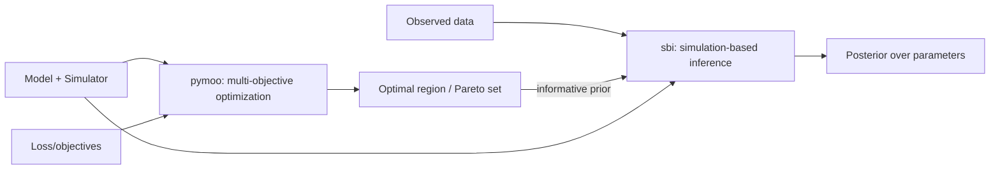

# moosbi
Pipeline for parameter optimization and simulation-based inference by composing `pymoo` (multi-objective optimization) and `sbi` (simulation-based inference).

## Overview
`moosbi` provides a reproducible pipeline to calibrate model parameters by first narrowing to an optimal region of parameter space via multi-objective optimization, then learning a posterior over parameters with simulation-based inference.

## All inputs are parameters
`moosbi` treats every model input as a parameter managed by `ParameterBank` in `moosbi/scip.py`. There is no separate "input" concept at the API level. Instead:
- **Sampled parameters**: set `is_sampled=True` (optimized/inferred by MOO/SBI).
- **Fixed parameters/inputs**: include them in the bank with `is_sampled=False` (constants like experimental settings, targets, or simulation controls).

This provides a single source of truth and a consistent `theta ↔ ParameterSet` mapping for both optimization and inference.

Example (OU process):
```python
from moosbi import IndependentParameter, ParameterBank

bank = ParameterBank(
    parameters={
        # model parameters
        "theta": IndependentParameter(1.0, is_sampled=True, range=(0.1, 5.0)),
        "mu":    IndependentParameter(0.0, is_sampled=True, range=(-2.0, 2.0)),
        "sigma": IndependentParameter(0.5, is_sampled=True, range=(0.05, 2.0)),
        # simulation controls (fixed)
        "T":      IndependentParameter(2.0, is_sampled=False, range=(0.1, 10.0)),
        "dt":     IndependentParameter(1e-3, is_sampled=False, range=(1e-4, 1e-2)),
        "burn_in":IndependentParameter(500, is_sampled=False, range=(0, 5000)),
        "x0":     IndependentParameter(0.0, is_sampled=False, range=(-5.0, 5.0)),
        # targets used by objectives (fixed)
        "target_mean": IndependentParameter(0.0, is_sampled=False, range=(-5.0, 5.0)),
        "target_var":  IndependentParameter(1.0, is_sampled=False, range=(0.0, 10.0)),
        "target_ac1":  IndependentParameter(0.8, is_sampled=False, range=(-0.99, 0.99)),
    },
    theta_sampling=True,
)
```

## Workflow
1. Use `pymoo` to solve a multi-objective optimization problem given a model and loss/objective functions, yielding a Pareto set/front and an "optimal" region of parameters.
2. Convert the Pareto solutions (and neighborhood) into an informative prior (e.g., KDE, Gaussian mixture, truncated ranges) for `sbi`.
3. Run `sbi` (e.g., SNPE/SNLE/SNRE) with the model simulator to learn a posterior over parameters, conditioned on observed data.
4. Validate, analyze trade-offs, and iterate if needed.



## Current status
- Early development. Parameter/space management lives in `moosbi/scip.py` and will be the foundation for the pipeline.
- APIs and examples are evolving; packaging and docs are forthcoming.

## References
- pymoo: https://pymoo.org/
- sbi: https://www.mackelab.org/sbi/

